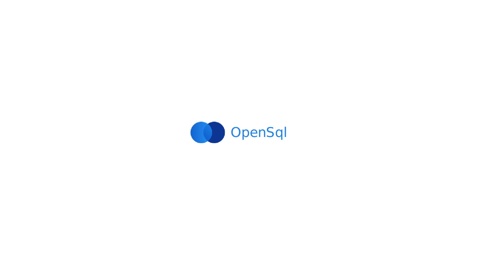

# OpenSql  &middot;    

**Opensql** is a javascript library for writing sql codes more easily and promise-based [Node.js](https://nodejs.org/en/about/) [ORM tool](https://en.wikipedia.org/wiki/Object-relational_mapping) for [Mysql](https://en.wikipedia.org/wiki/MySQL), [Postgres](https://en.wikipedia.org/wiki/PostgreSQL) and [Microsoft SQL Server](https://en.wikipedia.org/wiki/Microsoft_SQL_Server)

Would you like to contribute? Read [our contribution guidelines](https://github.com/opensql-org/opensql/blob/main/CONTRIBUTING.md) to know more. There are many ways to help! 😃

# [Documentation](https://docs-red-rho.vercel.app/)

Ready to start using Opensql?

Check out the [Getting Started](https://docs-red-rho.vercel.app/docs/configuration) page for a quick overview.
Or Read [API Docs](https://docs-red-rho.vercel.app/docs/category/advanced)

# ChangeLog

[Change Log](https://docs-red-rho.vercel.app/docs/category/version)

# License

Opensql is [MIT licensed](https://github.com/opensql-org/opensql/blob/main/LICENSE).
